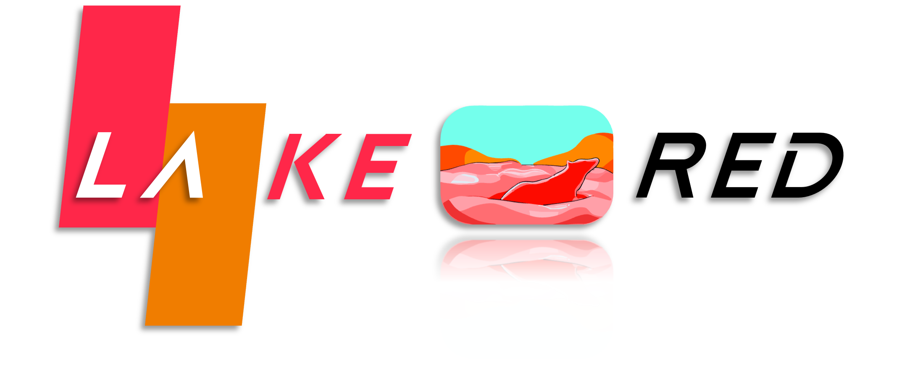
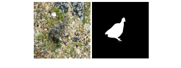
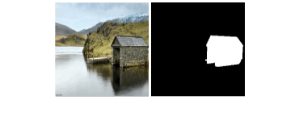

<div align=center>  </div>

<div align="center">
<h3>LAKE-RED: Camouflaged Images Generation by Latent Background Knowledge Retrieval-Augmented Diffusion</h3>


---

[**Pancheng Zhao**](https://www.zhaopancheng.top)<sup>1,2</sup> · [**Peng Xu**](https://www.pengxu.net/)<sup>3+</sup> · **Pengda Qin**<sup>4</sup> · [**Deng-Ping Fan**](https://dengpingfan.github.io/)<sup>2,1</sup> · [**Zhicheng Zhang**](https://zzcheng.top/)<sup>1,2</sup> · [**Guoli Jia**](https://exped1230.github.io/)<sup>1</sup> · [**Bowen Zhou**](http://web.ee.tsinghua.edu.cn/zhoubowen/zh_CN/index.htm)<sup>3</sup> · [**Jufeng Yang**](https://cv.nankai.edu.cn/)<sup>1,2</sup>

<sup>1</sup> VCIP & TMCC & DISSec, College of Computer Science, Nankai University

<sup>2</sup> Nankai International Advanced Research Institute (SHENZHEN· FUTIAN)

<sup>3</sup> Department of Electronic Engineering, Tsinghua University · <sup>4</sup>Alibaba Group 

<sup>+</sup>corresponding authors

**CVPR 2024**

<a href="http://arxiv.org/abs/2404.00292"></a>	<a href=''></a>	<a href='https://zhaopancheng.top/publication/LAKERED_CVPR24'></a>
</div>


<div align=center>

</div>


## 1. News

* 🔥**2024-07-15🔥:** Revised a misspelling in **Fig. 2** , and an error in **Equ. 4**. The latest version can be download on [**arXiv**](http://arxiv.org/abs/2404.00292)
* **2024-04-13:** Updated **Fig. 3**, including the computational flow of $\tilde{\mathrm{c} }^f$ and some of the variable names. The latest version can be download on [**arXiv**](http://arxiv.org/abs/2404.00292)（After 16 Apr 2024 00:00:00 GMT.）
* **2024-04-13:** **Full Code, Dataset, and model weight** have been released!
* **2024-04-03:** The **preprint** is now available on [**arXiv**](http://arxiv.org/abs/2404.00292).
* **2024-03-17:** **Basic code** uploaded. **Data, checkpoint and more code** will come soon ...
* **2024-03-11:** **Creating repository.** The Code will come soon ...
* **2024-02-27:** LAKE-RED has been accepted to **CVPR 2024**！


## 2. Get Start


#### 1. Requirements

If you already have the ldm environment, please skip it

A suitable conda environment named `ldm` can be created
and activated with:

```
conda env create -f ldm/environment.yaml
conda activate ldm
```


#### 2. Download Datasets and Checkpoints.

##### Datasets:

We collected and organized the dataset LAKERED from existing datasets. The training set is from COD10K and CAMO, and testing set is including three subsets: Camouflaged Objects (CO), Salient Objects (SO), and General Objects (GO).

| Datasets | [GoogleDrive](https://drive.google.com/file/d/1M96ipKc3nVK_Q_LViM6t9UjT8sayRxuZ/view?usp=sharing) | [BaiduNetdisk](https://pan.baidu.com/s/1KsAZuEsMG8n5WICWKaOgsw?pwd=v245)(v245) |
| :------: | :----------------------------------------------------------: | :----------------------------------------------------------: |

##### Results:

The results of this paper can be downloaded at the following link：

| Results | [GoogleDrive](https://drive.google.com/file/d/1VjOCNOtbQVwf6pZ30ccoo2N84-dEecVN/view?usp=sharing) | [BaiduNetdisk](https://pan.baidu.com/s/1XNWLDGRrKEUufboTMSTFhw?pwd=berx)(berx) |
| :-----: | :----------------------------------------------------------: | :----------------------------------------------------------: |

##### 

##### Checkpoint:

The Pre-trained Latent-Diffusion-Inpainting Model 

| Pretrained Autoencoding Models | [Link](https://heibox.uni-heidelberg.de/f/9c6681f64bb94338a069/?dl=1) |
| :----------------------------: | :----------------------------------------------------------: |
|       **Pretrained LDM**       | [**Link**](https://heibox.uni-heidelberg.de/f/4d9ac7ea40c64582b7c9/?dl=1) |

Put them into specified path: 

~~~ 
Pretrained Autoencoding Models: ldm/models/first_stage_models/vq-f4-noattn/model.ckpt
Pretrained LDM: ldm/models/ldm/inpainting_big/last.ckpt
~~~

The Pre-trained LAKERED Model 

| LAKERED | [GoogleDrive](https://drive.google.com/file/d/18SsVydpBPVwYNS5G_D42Ns0TlHJRzM-D/view?usp=sharing) | [BaiduNetdisk](https://pan.baidu.com/s/1EL-f4MVjPbLI5LRpHqYTWw?pwd=dzi8)(dzi8) |
| :-----: | :----------------------------------------------------------: | :----------------------------------------------------------: |

Put it into specified path: 

~~~ 
LAKERED: ckpt/LAKERED.ckpt
~~~


#### 3. Quick Demo:

You can quickly experience the model with the following commands:

~~~ 
sh demo.sh
~~~


#### 4. Train

##### 4.1 Combine the codebook with Pretrained LDM

~~~
python combine.py
~~~

##### 4.2 Start Train

You can change the `config_LAKERED.yaml'  files to modify settings. 

~~~
sh train.sh
~~~

Note：The solution to the **KeyError 'global_step'**

[**Quick fix**](https://github.com/nickyisadog/latent-diffusion-inpainting/issues/1) : You can --resume with the model that is saved during termination from error. (logs/checkpoints/last.ckpt)

You can also skip 4.1 and download the  [**LAKERED_init.ckpt**](https://pan.baidu.com/s/12HvsoV3nMRR5l6UXXlpDIQ?pwd=yfpe) to start training.


#### 5. Test

Generate camouflage images with foreground objects in the test set:

~~~
sh test.sh
~~~

Note that this will take a lot of time, you can download the [**results**](https://pan.baidu.com/s/1XNWLDGRrKEUufboTMSTFhw?pwd=berx).


#### 6. Eval

Use torch-fidelity to calculate FID and KID:

~~~
pip install torch-fidelity
~~~

You need to specify the result root and the data root, then eval it by running:

~~~
sh eval.sh
~~~

For the “RuntimeError: stack expects each tensor to be equal size”

This is due to inconsistent image sizes.

Debug by following these steps：

​	(1) Find the datasets.py in the torch-fidelity

~~~
anaconda3/envs/envs-name/lib/python3.8/site-packages/torch_fidelity/datasets.py
~~~

​	(2) Import torchvision.transforms

~~~
import torchvision.transforms as TF
~~~

​	(3) Revise line 24:

~~~
self.transforms = TF.Compose([TF.Resize((299,299)),TransformPILtoRGBTensor()]) if transforms is None else transforms
~~~

Or you can manually modify the size of the images to be the same.


## Contact

If you have any questions, please feel free to contact me:

zhaopancheng@mail.nankai.edu.cn

pc.zhao99@gmail.com


## Citation

If you find this project useful, please consider citing:

```bibtex
@inproceedings{zhao2024camouflaged,
      author = {Zhao, Pancheng and Xu, Peng and Qin, Pengda and Fan, Deng-Ping and Zhang, Zhicheng and Jia, Guoli and Zhou, Bowen and Yang, Jufeng},
      title = {LAKE-RED: Camouflaged Images Generation by Latent Background Knowledge Retrieval-Augmented Diffusion},
      booktitle = {Proceedings of the IEEE/CVF Conference on Computer Vision and Pattern Recognition (CVPR)},
      year = {2024},
}
```


## Acknowledgements

This code borrows heavily from [latent-diffusion-inpainting](https://github.com/nickyisadog/latent-diffusion-inpainting), thanks the contribution of [nickyisadog](https://github.com/nickyisadog)
