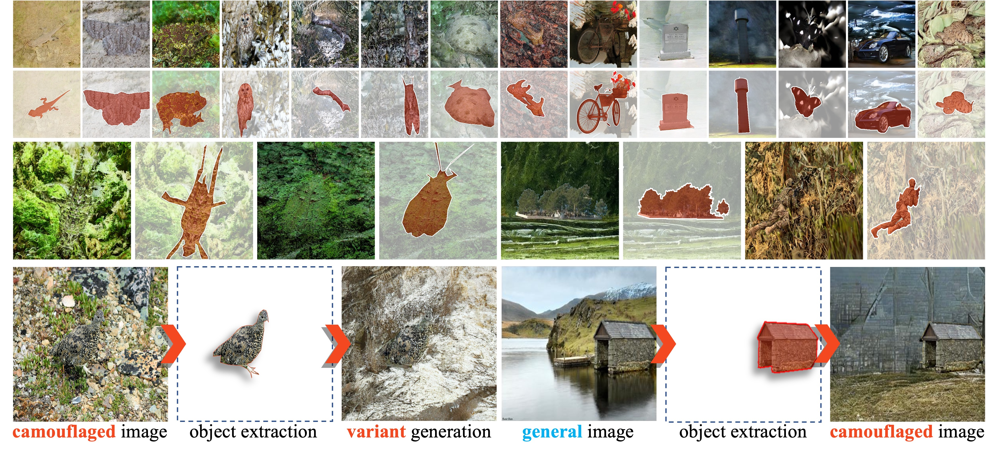

<div align="center">
<h3>LAKE-RED: Camouflaged Images Generation by Latent Background Knowledge Retrieval-Augmented Diffusion</h3>


---

**Pancheng Zhao**<sup>1</sup> · [**Peng Xu**](https://www.pengxu.net/)<sup>2+</sup> · **Pengda Qin**<sup>3</sup> · [**Deng-Ping Fan**](https://dengpingfan.github.io/)<sup>1</sup> · [**Zhicheng Zhang**](https://zzcheng.top/)<sup>1</sup> · [**Guoli Jia**](https://exped1230.github.io/)<sup>1</sup> · [**Bowen Zhou**](http://web.ee.tsinghua.edu.cn/zhoubowen/zh_CN/index.htm)<sup>2</sup> · [**Jufeng Yang**](https://cv.nankai.edu.cn/)<sup>1</sup>

<sup>1</sup>College of Computer Science, Nankai University · <sup>2</sup>Department of Electronic Engineering, Tsinghua University · <sup>3</sup>Alibaba Group 

<sup>+</sup>corresponding authors

**CVPR 2024**

<a href=""></a>	<a href=''></a>	<a href=''></a>	<a href='https://depth-anything.github.io'></a>
</div>




## News

* **2024-03-11:** Creating repository. The Code will come soon ...
* **2024-02-27:** LAKE-RED has been accepted to CVPR 2024！

## Citation

If you find this project useful, please consider citing:

```bibtex
@inproceedings{zhao2024camouflaged,
      author = {Zhao, Pancheng and Xu, Peng and Qin, Pengda and Fan, Deng-Ping and Zhang, Zhicheng and Jia, Guoli and Zhou, Bowen and Yang, Jufeng},
      title = {LAKE-RED: Camouflaged Images Generation by Latent Background Knowledge Retrieval-Augmented Diffusion},
      booktitle = {Proceedings of the IEEE/CVF Conference on Computer Vision and Pattern Recognition (CVPR)},
      year = {2024},
}
```
